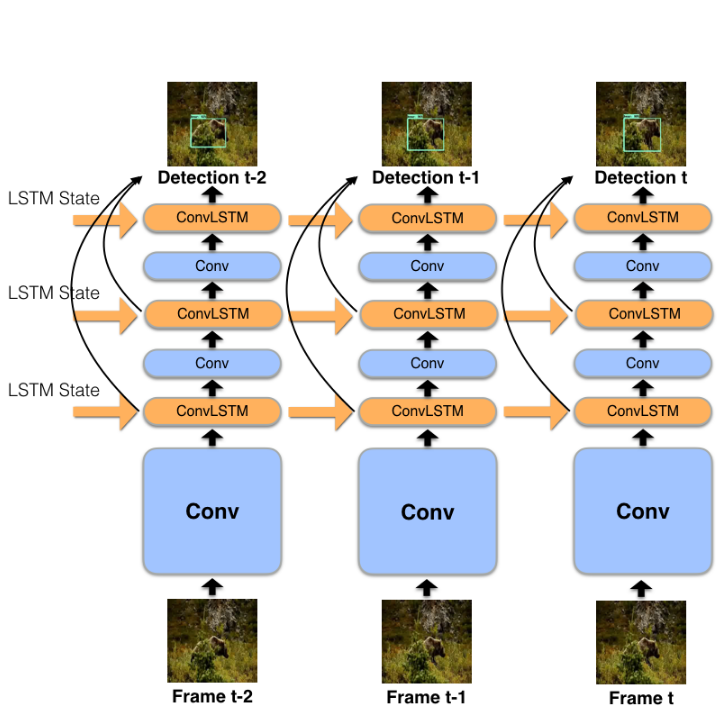

# [Mobile Video Object Detection with Temporally-Aware Feature Maps](https://arxiv.org/abs/1711.06368)

## Abstract

* This  paper  introduces  an  online  model  for  object  detection  in  videos  designed  to  run  in  real-time.

*  A combination of single-image object detection with convolutional LSTM is used.

* Additionally, an efficient Bottleneck-LSTM layer is used to propagate feature maps across frames.

* The model reaches a real-time inference speed of up to 15 FPS on a mobile CPU.

## Introduction

*  Efficiency is a primary consideration when designing models for mobile and embedded platforms.

* The video domain presents the additional opportunity and challenge of leveraging temporal cues. **This paper investigates the idea of building upon these  single-frame  models  by  adding  temporal  awareness while preserving their speed and low resource consumption**.

* Since videos exhibit temporal continuity, objects in adjacent frames will remain in similar locations and detections will not vary substantially.  Hence, detection information from earlier frames can be used to refine predictions at the current frame.

    * We know that the high-level semantics of image content vary slowly over video frames, this knowledge has been used as a means of regularization in feature learning. In simple words, **we can treat videos as unsupervised data sources**. Such data redundancy and continuity can also be exploited to reduce the computation cost.

* The idea is to exploit continuity at the feature level by conditioning the feature maps of each frame on corresponding feature maps from previous frames via recurrent network architectures.

* **The goal is for the convolutional layer to output a feature map hypothesis, which is then fed into the LSTM and fused with temporal context  from previous frames  to  output  a  refined, temporally aware feature map**.

* Evaluation is done on the Imagenet VID 2015 dataset.

## Approach

Naive integration of LSTM's won't be good for running in real time. The main idea is to use a Bottleneck-LSTM with depthwise separable convolutions and bottleneck design principles.

### 

